# ECE 461 HaaS Proof of Concept

Hardware-as-a-Service (HaaS) web application inspired by the University of Utah [POWDER](https://powderwireless.net/) program. Users create accounts and projects, view hardware capacity and availability, and check out / check in units from **HWSet1** and **HWSet2**.

This repository is the single deliverable repo for all project phases.

Full project plan, architecture, and backlog: see the **[Wiki](../../wiki)**.

---

## Phase 1 Deliverables

| ID | Requirement | Status |
| --- | --- | --- |
| R1-1 | Project plan (team, sprints, collaboration, methodology, toolchain) | In this README |
| R1-2 | All features on a board, with initial work items | [User stories](#r1-2-features-and-work-items) below |
| R1-3 | High-level application sketch | [Sketch](docs/architecture/sketch.svg) |
| R1-4 | Choice of tools and approach | [Toolchain](#toolchain-and-approach) |

---

## R1-1 Project Plan

### Team

| Name | Role | GitHub |
| --- | --- | --- |
| Tyler Tekin | Backend (Java) | [TylerTekin](https://github.com/tyler-at) |
| Joseph Gyomber | Backend (Java) | [JGyomber](https://github.com/jgyomber) |
| May He | Backend (Node.js) | [Maaay551](https://github.com/maaay551) |
| Nolan Arellano | Frontend (TypeScript) | [Cypher-Geist](https://github.com/cypher-geist) |
| Abdon Morales | Frontend (TypeScript) | [AbdonMorales](https://github.com/abdonmorales) |
| Rishi Wadhwa | Database / Cloud Deployment | [RishiWadhwa](https://github.com/RishiWadhwa) |

Roles are a starting split. Work is assigned per sprint from the board.

### Implementation methodology

**Agile Scrum**

- Work is planned as user stories, research spikes, and technical-debt items.
- Each story is small enough for one person or a pair, written in three sentences or less, and mapped to a stakeholder need.
- GitHub **Projects** holds user stories. GitHub **Issues** holds bugs and improvements (separate boards).
- Changes land through pull requests into `dev`, then `main` for phase submissions.

### Sprint cadence

| Item | Plan |
| --- | --- |
| Sprint length | 1 week |
| Sprint planning | Monday 3:00–4:00pm, Senior Design Room |
| Standups | 3x / week, 10 min (Slack huddle or Zoom) |
| Review + retro | Friday in lab / recitation |

| Phase | Goal |
| --- | --- |
| Phase 1 | Plan, board, toolchain |
| Phase 2 | Users, projects, and hardware in MongoDB; APIs used by the app (no hard-coded page data); cloud URL for TAs |

### Collaboration tools

| Tool | Use |
| --- | --- |
| GitHub | Source control, PRs, code review |
| GitHub Projects | User-story board (Backlog → Ready → In Progress → Review → Done) |
| GitHub Issues | Bugs and improvements only |
| Messages | Daily chat, standup notes, blockers |
| Zoom | Planning, reviews, pairing |
| VS Code | Development IDE |

### Branching

- `main` — phase deliverables
- `dev` — integration branch
- `feature/<short-name>` — one story or spike per branch

---

## Toolchain and Approach

| Layer | Choice | Why |
| --- | --- | --- |
| Frontend | React | Course-recommended UI for login, projects, and hardware panels |
| Backend | Node.js (JavaScript) and Java | Node.js for users and projects; Java for hardware checkout / check-in |
| Database | MongoDB | Users, project details, and hardware sets |
| API style | REST | `/login`, `/create_project`, `/check_out`, `/check_in`, and related routes |
| Auth | Hashed passwords (bcrypt or equivalent) | SR3 / SN1 — no plaintext credentials |
| Testing | Jest (JS), JUnit (Java) | Login, projects, checkout math |
| Hosting (Phase 2) | Cloud URL (Render, Railway, or Heroku) | TAs must open the app in a browser |
| CI | GitHub Actions (Phase 2) | Lint + tests on PRs |

### Planned service split

```
React client
    ├── Node.js API     users, login, projects
    └── Java API        HWSet1 / HWSet2, checkout, check-in
            └── MongoDB (users, projects, hardwareSets)
```

| Area | Endpoints |
| --- | --- |
| Users | `/login`, `/add_user`, `/get_user_projects_list`, `/join_project` |
| Projects | `/create_project`, `/get_project_info` |
| Hardware | `/get_all_hw_names`, `/get_hw_info`, `/check_out`, `/check_in`, `/create_hardware_set` |

`hardwareSets` holds **HWSet1** and **HWSet2**. Each set has `capacity` (total units) and `available` (not currently checked out).

### Planned repo layout

```
client/          React app
server-js/       Node.js user + project API
server-java/     Java hardware API
README.md
```

---

## Stakeholder needs and system requirements

| ID | Need / requirement |
| --- | --- |
| SN0 | Accepted quality and reliability metrics |
| SN1 | Secure user accounts and projects |
| SN2 | View status of all hardware resources |
| SN3 | Request available hardware |
| SN4 | Checkout and manage resources |
| SN5 | Check-in resources and refresh hardware status |
| SN6 | Deliver PoC on schedule, with room to scale |
| SR1 | Delivered within schedule, with periodic stakeholder updates |
| SR2 | Front-end for inputs and outputs |
| SR3 | Encrypted user-id and password |
| SR4 | Create new projects or access existing ones |
| SR5 | Database for users, project codes, project details, and resources |

---

## R1-2 Features and Work Items

Create a GitHub Project named `HaaS User Stories` with columns **Backlog**, **Ready**, **In Progress**, **Review**, and **Done**. Add each item below as a card. Do not mix bugs onto this board.

Labels: `user-story`, `research`, `tech-debt`, `phase-1`, `phase-2`.

### Feature 1 — User management

| ID | Type | Story | Points | Phase | Maps to |
| --- | --- | --- | --- | --- | --- |
| US-01 | User story | As a new user, I want a New User popup on the sign-in screen so that I can create a userid and password. | 3 | 2 | SN1, SR2, SR4 |
| US-02 | User story | As a registered user, I want to sign in with my userid and password so that I can reach my projects. | 3 | 2 | SN1, SR2 |
| US-03 | User story | As a user, I want my password stored hashed (never plaintext) so that my account stays secure. | 5 | 2 | SN1, SR3 |
| US-04 | User story | As a signed-in user, I want to create a project with a name, description, and projectID so that hardware usage is tracked per project. | 3 | 2 | SN1, SR4, SR5 |
| US-05 | User story | As a signed-in user, I want to join an existing project by projectID so that I can share hardware with my group. | 3 | 2 | SN1, SR4 |
| US-06 | User story | As a signed-in user, I want to see the projects I belong to so that I can pick one before checking out hardware. | 2 | 2 | SN1, SR2, SR5 |

### Feature 2 — Resource management

| ID | Type | Story | Points | Phase | Maps to |
| --- | --- | --- | --- | --- | --- |
| US-07 | User story | As a project member, I want to see the capacity of HWSet1 and HWSet2 so that I know the total pool size. | 2 | 2 | SN2, SR2, SR5 |
| US-08 | User story | As a project member, I want to see the availability of HWSet1 and HWSet2 so that I know what I can request. | 2 | 2 | SN2, SN3, SR5 |
| US-09 | User story | As a project member, I want to enter how many units to check out from a hardware set so that my project can reserve them. | 5 | 2 | SN3, SN4 |
| US-10 | User story | As a project member, I want to check in units my project holds so that they return to the shared pool. | 5 | 2 | SN4, SN5 |
| US-11 | User story | As a project member, I want checkout and check-in to persist in the database so that every user sees the same availability. | 5 | 2 | SN2, SN5, SR5 |
| US-12 | User story | As a user of the app, I want all user, project, and hardware data loaded from APIs (no hard-coded page data) so that the UI reflects the live system. | 3 | 2 | SN0, SR2, SR5 |

### Feature 3 — Platform and delivery

| ID | Type | Story | Points | Phase | Maps to |
| --- | --- | --- | --- | --- | --- |
| US-13 | User story | As a TA, I want the PoC hosted at a public URL so that I can grade the running app. | 5 | 2 | SN6, SR1 |
| US-14 | User story | As a developer, I want REST endpoints for users, projects, and hardware so that the React client never talks to MongoDB directly. | 5 | 2 | SR2, SR5 |

### Research spikes

| ID | Type | Item | Points | Phase |
| --- | --- | --- | --- | --- |
| RS-01 | Research | Spike: MongoDB schema for `users`, `projects`, and `hardwareSets` (capacity, availability, checked-out-per-project). | 2 | 1 |
| RS-02 | Research | Spike: password hashing and session/token approach for the Node.js API. | 2 | 1 |
| RS-03 | Research | Spike: how Node.js and Java share MongoDB safely for concurrent checkout. | 3 | 1 |
| RS-04 | Research | Spike: cloud host (Render / Railway / Heroku) for a React + Node + Java deploy. | 2 | 2 |

### Technical debt

| ID | Type | Item | Points | Phase |
| --- | --- | --- | --- | --- |
| TD-01 | Tech debt | Add Jest and JUnit smoke tests for login, create project, checkout, and check-in. | 3 | 2+ |
| TD-02 | Tech debt | GitHub Actions to run tests on every PR. | 2 | 2+ |
| TD-03 | Tech debt | Shared validation for checkout amounts (no negative, no over-capacity). | 2 | 2 |
| TD-04 | Tech debt | Keep bugs on a separate Issues board from this story board. | 1 | 1 |

### Suggested Sprint 1 (Phase 1 close-out)

**RS-01, RS-02, RS-03, TD-04**, plus creating the GitHub Project and cards for US-01–US-14.

---

## MVP feature checklist

**User management**

- [ ] Sign-in with userid and password (US-02)
- [ ] New User popup to register (US-01)
- [ ] Create project: name, description, projectID (US-04)
- [ ] Join / open an existing project (US-05, US-06)
- [ ] MongoDB for users and projects (US-12, RS-01)
- [ ] API access to stored data (US-14)
- [ ] Encrypted / hashed credentials (US-03)

**Resource management**

- [ ] Display HWSet1 and HWSet2 capacity (US-07)
- [ ] Display HWSet1 and HWSet2 availability (US-08)
- [ ] Hardware stored and read from the database (US-11)
- [ ] Checkout and check-in unit counts (US-09, US-10)

---

## R1-3 High-level sketch



The React client has the two panels from the spec (User Management, Resource Management). Node.js handles users and projects. Java handles HWSet1 / HWSet2 checkout and check-in. Both APIs use the same MongoDB instance (`users`, `projects`, `hardwareSets`).
